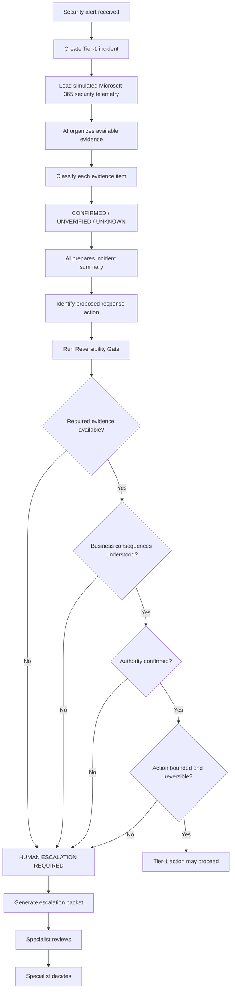

# WEEK 8 — BUSINESS BENDING
## Incident Gate
**Ana María Matas**  
**Chapter 7 — Quantum Genocide**

## 1. Problem in my words

The problem is not simply that Mexican SMEs lack cybersecurity technology. Many organizations can already buy Microsoft 365 security features, endpoint protection, backups, MFA, monitoring tools, and other defensive products. The harder operational gap appears when an alert arrives and someone has to interpret incomplete evidence and decide what can safely happen next.

In a small company, that first responder may be a generalist IT provider rather than a cybersecurity specialist. The danger is not only missing an attack. It is also taking a consequential action too early: interrupting production, destroying evidence, locking out an administrator, or treating an uncertain signal as proof of compromise.

My working slice tests a narrow version of the Talent Bridge idea. AI helps a generalist IT provider perform bounded Tier-1 work: structure evidence, distinguish what is known from what is missing, explain the incident in plain language, and prepare escalation. It does not increase the operator's authority simply because the interface sounds confident.

The product therefore focuses on one decision boundary: before a proposed response action can proceed, the system checks whether the required evidence exists, the business consequences are understood, the operator's authority is confirmed, and the action is sufficiently bounded and reversible. If those conditions are not satisfied, the workflow stops and prepares a specialist escalation packet.

## 2. Exact user

**Carlos Ramírez, 36 — Generalist IT Provider**

Carlos provides outsourced IT support to several small Mexican companies. He manages Microsoft 365 accounts, employee laptops, basic network problems, access issues, and vendor coordination.

He is comfortable with ordinary IT administration, but he is not a cybersecurity specialist, forensic responder, or SOC analyst.

His core question is:

> **“What can I safely do myself right now, and when do I need to stop and escalate?”**

## 3. Success definition

> **Before the module closes, Carlos can review a simulated Microsoft 365 security incident, distinguish confirmed evidence from unknown or unverified information, evaluate one proposed response through the Reversibility Gate, and generate a structured escalation packet when the action requires specialist judgment.**

Success is not proving that the account is compromised or automatically stopping an attack. Success is enforcing a safer Tier-1 decision boundary.

## 4. Approved working slice

The prototype tests one scenario: **possible Microsoft 365 credential compromise**.

The application guides Carlos through four states:

1. **Incident Intake** — review the simulated security alert.
2. **Evidence Review** — distinguish CONFIRMED, UNVERIFIED, and UNKNOWN information.
3. **Reversibility Gate** — evaluate one proposed response action.
4. **Escalation Packet** — prepare the incident for specialist review when Tier-1 authority is insufficient.

All Microsoft 365 / Defender-style incident data used in the prototype is invented and must be visibly labeled **SIMULATED SECURITY TELEMETRY** or its Spanish equivalent.

### Approved demo evidence

- Unusual foreign login — **CONFIRMED**
- Employee recognizes login — **UNKNOWN**
- Device security state — **UNVERIFIED**
- Business-critical dependencies — **UNKNOWN**

A critical semantic rule is:

> **CONFIRMED evidence does not mean CONFIRMED compromise.**

The application must preserve that distinction.

## 5. Proposed action and Reversibility Gate

The proposed response action is:

**Revoke active user sessions**

Before Carlos can treat that action as authorized, the prototype evaluates:

| Gate question | Demo state |
|---|---|
| Technical reversibility | YES |
| Business consequences understood | NO / UNKNOWN |
| Required evidence available | NO |
| Authority confirmed | UNVERIFIED |

For the approved demo, the result must therefore be:

**HUMAN ESCALATION REQUIRED**

The gate is deterministic application logic. The LLM may explain the evidence and prepare escalation language, but it may not override the gate or authorize the action.

## 6. Escalation packet

When the gate blocks Tier-1 action, Incident Gate prepares a structured packet containing:

- incident type;
- affected demo account;
- confirmed evidence;
- unknown and unverified information;
- proposed response action;
- reason the action was blocked;
- questions requiring specialist judgment.

Example:

**Incident:** Possible credential compromise  
**Account:** empleado01@empresa-demo.mx  
**Confirmed evidence:** Unusual foreign login  
**Unknowns:** User recognition of login; business dependencies  
**Unverified:** Device security state; operator authority where applicable  
**Proposed action:** Revoke active sessions  
**Block reason:** Required evidence, business consequences, and/or authority are not sufficiently established  
**Specialist decision required:** Determine appropriate containment and additional evidence requirements

## 7. Flow

## 8. Actor swimlane

```mermaid
flowchart LR
    subgraph IG["Incident Gate — AI + System"]
        A1[Load simulated telemetry]
        A2[Structure evidence]
        A3[Apply evidence labels]
        A4[Prepare summary]
        A5[Run deterministic gate]
        A6[Block action and prepare packet]
        A1 --> A2 --> A3 --> A4
        A5 --> A6
    end

    subgraph C["Carlos — Generalist IT Provider"]
        C1[Receives alert]
        C2[Reviews evidence]
        C3[Reviews proposed action]
        C4[Reads gate result]
        C5[Sends escalation]
        C1 --> C2 --> C3 --> C4 --> C5
    end

    subgraph S["Cybersecurity Specialist"]
        S1[Receives packet]
        S2[Reviews evidence and unknowns]
        S3[Applies expert judgment]
        S4[Approves or changes response]
        S1 --> S2 --> S3 --> S4
    end

    C1 --> A1
    A4 --> C2
    C3 --> A5
    A6 --> C4
    C5 --> S1
```

The approved rendered Mermaid diagrams are also preserved as project assets.

## 9. Benchmark

**Best existing benchmark: Microsoft Defender XDR + Microsoft Security Copilot.**

Microsoft Defender XDR with Security Copilot is the strongest benchmark identified for AI-assisted incident triage and response. Incident Gate differs by focusing narrowly on a generalist IT provider serving a Mexican SME and by making missing evidence, business consequences, and operator authority explicit inputs to a Reversibility Gate.

The prototype is not intended to reproduce Defender. It tests whether a narrower operational boundary for non-specialist Tier-1 responders creates useful value.

## 10. Why this is not just a Defender clone

Incident Gate does not attempt to replace security telemetry, endpoint detection, or Microsoft security tooling. It begins after an alert exists.

Its hypothesis is that a generalist provider can safely close more bounded Tier-1 work if AI reduces evidence-organization burden while a deterministic gate prevents the interface from inflating the operator's authority.

The independent value disappears if existing native security/MSP tools already provide an equivalent workflow for this target user or if meaningful Tier-1 work still requires expert review in nearly every case.

## 11. Long view — three years

If this slice worked, the full product in three years would support a narrow set of common SME security incidents and help generalist IT providers structure evidence, complete bounded Tier-1 work, and escalate only the cases requiring scarce specialist judgment. It could connect to existing security tools rather than becoming another source of truth, while maintaining explicit evidence, authority, and reversibility gates. The product would earn its existence only if it measurably reduces response time and specialist workload without increasing unsafe actions or false confidence.

## 12. Scope cut

This prototype does **not** build:

- antivirus;
- password management;
- a full SOC dashboard;
- autonomous containment;
- remote control;
- forensic attribution;
- malware analysis;
- ransomware negotiation or payment;
- attack-back functionality;
- a Microsoft Defender clone;
- a multi-client MSP platform;
- real Microsoft tenant integration;
- billing or customer onboarding;
- broad incident libraries;
- real customer data.

The slice remains intentionally narrow.

## 13. Architecture + Dragon Stack

| Layer | Implementation |
|---|---|
| Front end | Next.js + Tailwind CSS |
| LLM | Server-side LLM API |
| Security tooling/data | Simulated Microsoft 365 / Defender-style security telemetry |
| Third component | Structured incident JSON + deterministic Reversibility Gate logic |
| Validation | Schema / allow-list validation for structured values |
| Deployment | Vercel free tier |
| Version control | GitHub |

The implementation must separate presentation, AI assistance, and deterministic decision logic.

The LLM can summarize and organize evidence, identify explicitly missing context, explain uncertainty in plain Spanish, and draft escalation text.

The LLM cannot determine Carlos's authority, invent telemetry, manufacture missing organizational context, override the gate, independently authorize containment, or make forensic attribution.

## 14. Blueprint conditions and shadow clause

The build must preserve the Week 8 Blueprint conditions:

1. Distinguish **CONFIRMED, UNVERIFIED, UNKNOWN, and HUMAN ESCALATION REQUIRED**.
2. Never convert incomplete evidence into certainty or claim the organization is secure.
3. AI may not become the attacker or the authority.
4. Consequential actions require an explicit authority gate.
5. Missing incident-critical context cannot be manufactured.
6. The experience must work for a non-specialist under pressure using simple language and clear next steps.
7. The business model must eventually prove that AI removes meaningful Tier-1 workload rather than simply creating more escalations.

### Shadow: Authority inflation

The principal shadow is **authority inflation**: a professional AI interface may make Carlos feel authorized to take consequential actions beyond his competence or organizational authority.

The structural response is the **Action / Reversibility Gate**.

Evidence Mode may collect, organize, and explain information. Action guidance can proceed only when the required evidence, authority, business consequences, and reversibility conditions are satisfied.

For the demo scenario they are not satisfied, so the action is blocked and escalated.

## 15. Security Floor

The implementation must satisfy:

1. **No secrets in code or repository.** API keys belong in environment variables.
2. **No real personal data in demos or seeds.** All people, companies, accounts, and incident data are invented.
3. **Authentication if personal data is stored.** This slice should avoid persistent personal data and unnecessary authentication.
4. **RLS if user-data Supabase tables are introduced.** Avoid introducing a database unless necessary.
5. **Input validation.** Validate structured values, lengths, types, and allowed evidence states.
6. **Visible simulation labels.** Simulated security data must never be presented as live telemetry.

## 16. Mechanical test plan

After the first functional deployment:

1. Open the live URL.
2. Confirm the app loads without breaking errors.
3. Confirm the simulated-data label is visible.
4. Start the credential-compromise scenario.
5. Confirm evidence displays CONFIRMED, UNVERIFIED, and UNKNOWN correctly.
6. Confirm a CONFIRMED unusual login does not become a CONFIRMED account compromise.
7. Confirm the AI or fallback summary preserves uncertainty.
8. Navigate to the proposed action.
9. Confirm the action is “Revoke active user sessions.”
10. Confirm the demo gate values.
11. Confirm the result is HUMAN ESCALATION REQUIRED.
12. Confirm the LLM cannot override the deterministic gate.
13. Confirm the escalation packet contains all required fields.
14. Confirm copy/export behavior works.
15. Test malformed input if editable input exists.
16. Test long text.
17. Test navigation and refresh behavior.
18. Check for text overflow and obvious responsive breakage.
19. Check the browser console.
20. Confirm no secrets are exposed.
21. Confirm no real personal data exists.
22. Find at least one **real** bug.
23. Document expected behavior, actual behavior, reproduction steps, cause, fix, and retest.
24. Fix the bug and redeploy.

## 17. Persona test

The Persona Test uses a fresh LLM conversation representing Carlos Ramírez.

Carlos understands ordinary Microsoft 365 administration and general IT support but does not have formal forensic or SOC experience.

Screenshots are shown in workflow order. Carlos attempts the task and narrates confusion.

The test logs every confusion and then identifies the single biggest usability problem.

Two important hypotheses to observe, without forcing the result, are:

- Carlos may interpret CONFIRMED evidence as CONFIRMED compromise.
- Carlos may interpret an AI-generated proposed action as authorization to act.

Only the smallest fix for the actual highest-severity usability problem should be implemented.

## 18. What we measure

The prototype does not attempt to prove the entire business model.

The slice should make it possible to observe whether:

- Carlos can correctly distinguish evidence states;
- he understands why the system refuses to increase his authority;
- he can identify when specialist judgment is required;
- the escalation packet reduces repeated intake work;
- the workflow avoids false certainty;
- the AI layer removes useful Tier-1 cognitive/clerical work without creating unnecessary escalation.

## 19. Kill conditions

The idea should be weakened or killed if:

- Carlos + AI cannot safely close meaningful Tier-1 work without expert review;
- the AI layer generates more specialist work than it removes;
- operators systematically treat AI language as authority despite the gate;
- the evidence required for safe decisions is usually unavailable;
- native Microsoft / Google / MSP security tools already provide a comparable workflow for this user;
- customers will not pay enough to cover delivery and specialist capacity;
- every incident requires extensive customization.

## 20. Build and deployment discipline

The implementation requires at least five meaningful commits and two deployments.

The target sequence is:

1. Foundation and approved UI shell.
2. Incident Intake + Evidence Review.
3. Deterministic Reversibility Gate.
4. Deployment 1.
5. Escalation Packet.
6. Mechanical test and discovery of a real bug.
7. Bug-fix commit.
8. Persona Test using deployed screenshots.
9. Smallest approved Persona Test fix.
10. Deployment 2.

Maintain `DECISIONS.md` throughout the build.

Each session closes with:

- required checks;
- DECISIONS.md update;
- next first move;
- commit;
- push.

## 21. Research sources

The benchmark research used the following Microsoft Learn resources:

1. *Triage and investigate incidents with guided responses with Microsoft Copilot in Microsoft Defender.*
2. *Overview of the Action center in Microsoft Defender XDR.*
3. *Get notified about remediation actions.*
4. *What is Microsoft Defender for Business?*
5. *Resources for Microsoft partners working with small and medium-sized businesses.*
6. *Customize incident responses for your organization.*

The project conditions, shadow, declaration, and scope are also grounded in the approved **Week 8 Team Bending Blueprint — Chapter 7: Quantum Genocide**.

---

**Packet status:** APPROVED BEFORE CODE.  
**Working slice:** Incident Gate.  
**Builder:** Ana María Matas.
